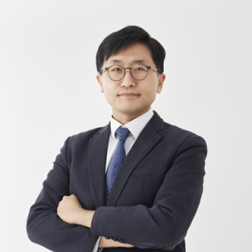
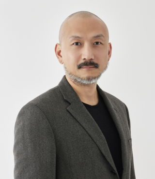
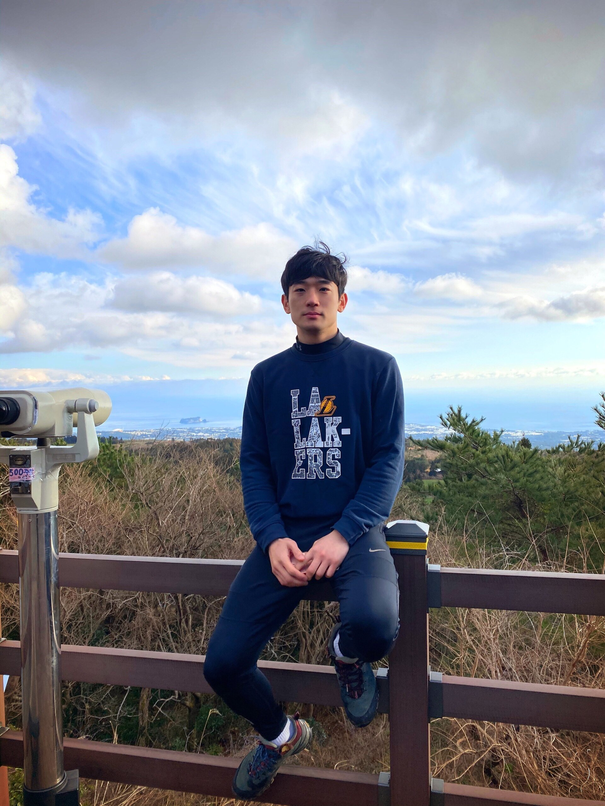
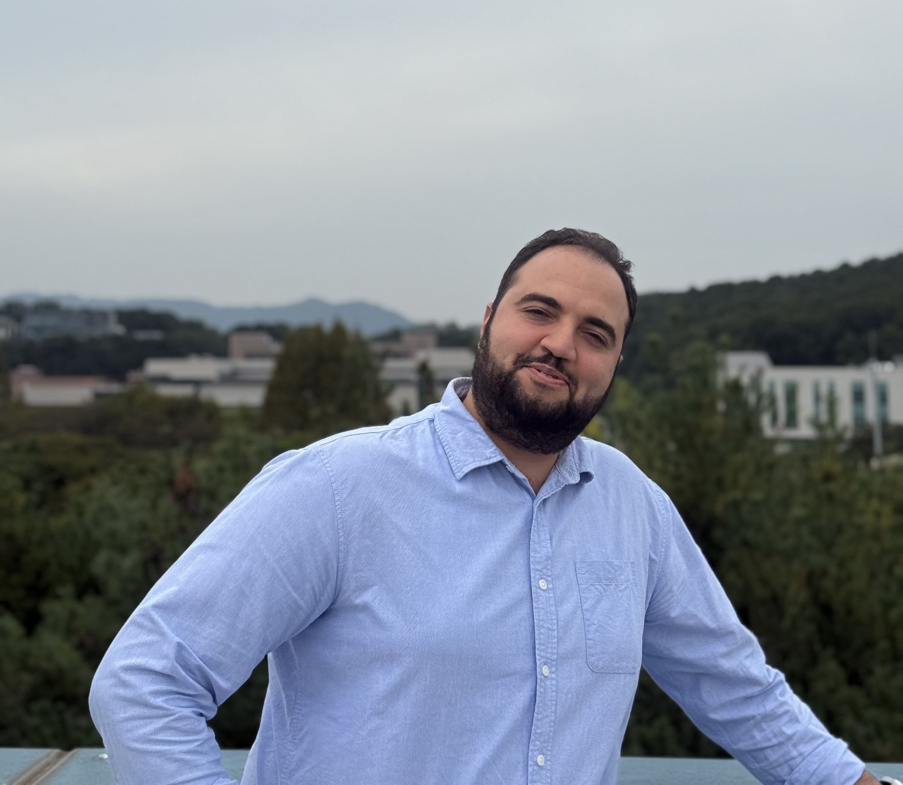
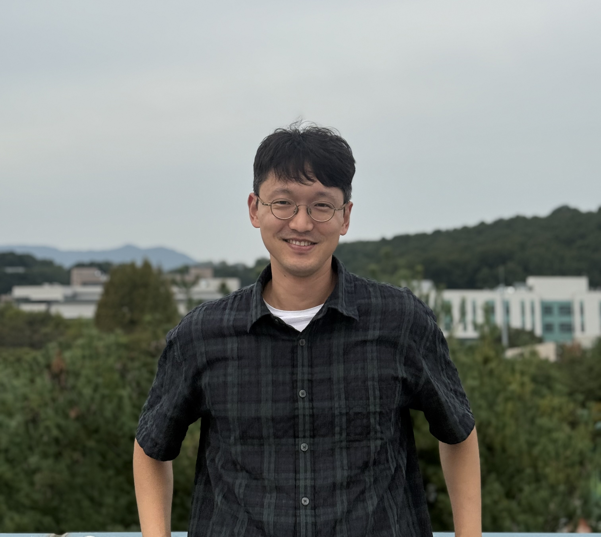
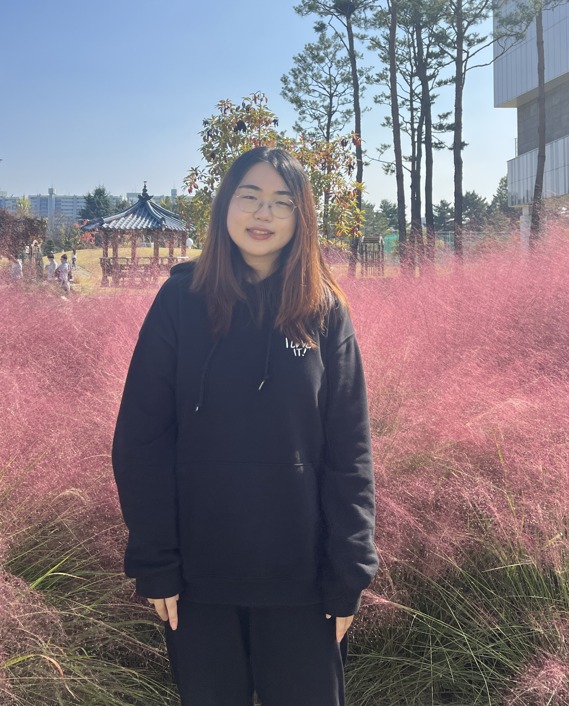
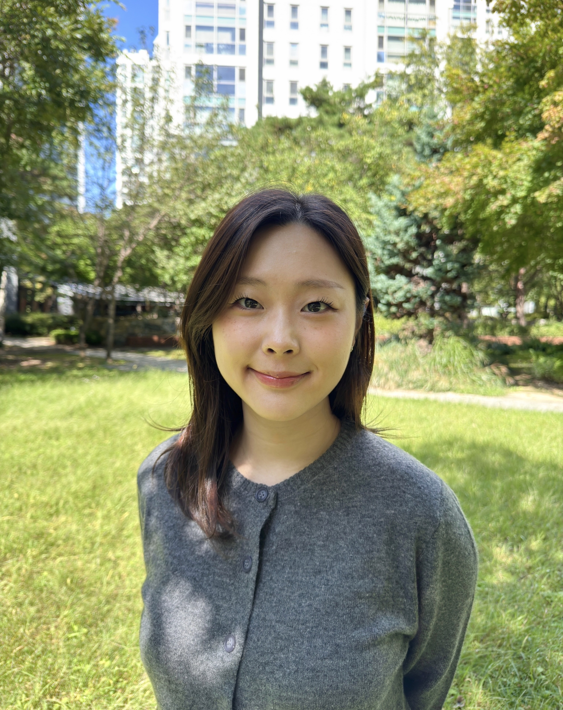
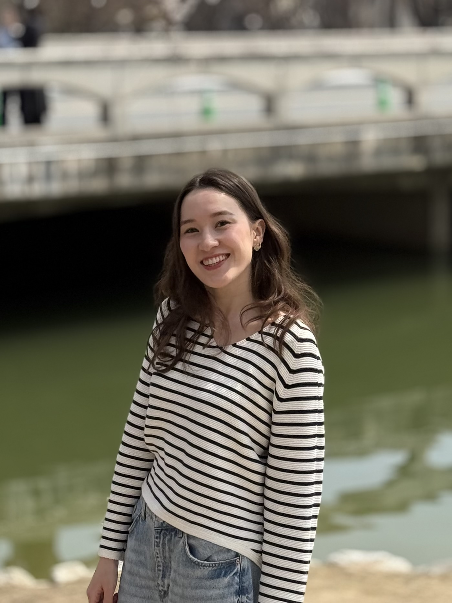
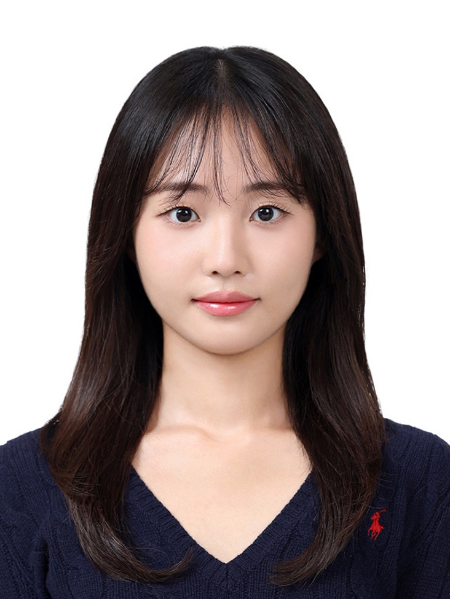
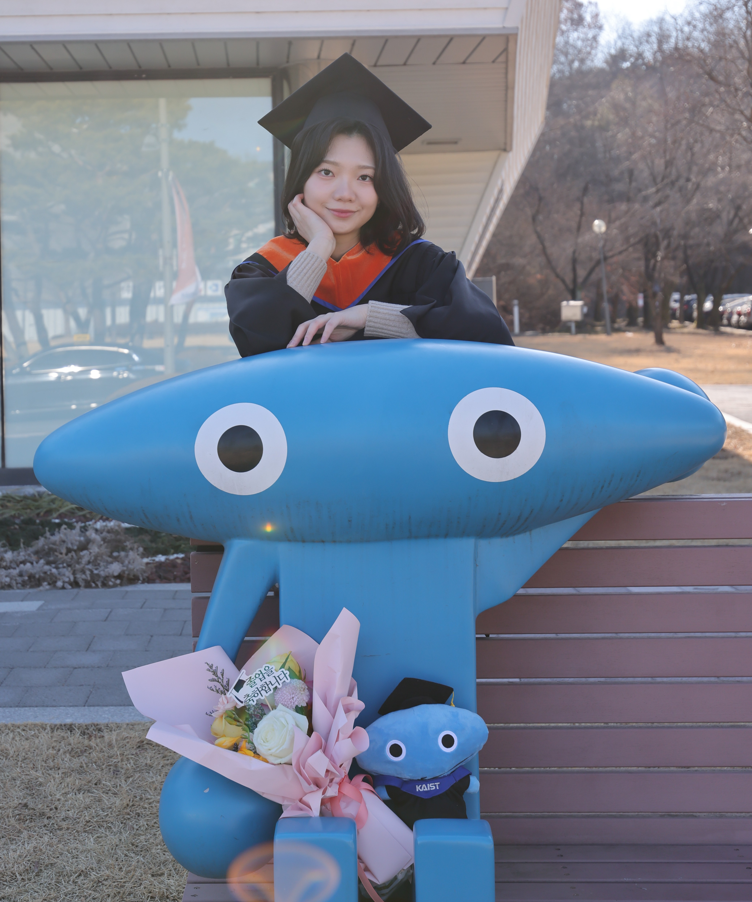

::: {=html}
<link rel="stylesheet" href="members1.css"> <link rel="stylesheet" href="https://cdnjs.cloudflare.com/ajax/libs/font-awesome/6.5.0/css/all.min.css"> <link rel="stylesheet" href="https://cdn.jsdelivr.net/gh/jpswalsh/academicons/css/academicons.min.css">

```{=html}
<script src="members1.js"></script>
```
:::

:::: members-hero
 

::: members-hero-content
   

<p class="members-subtitle">

KAIST IAM Group

</p>

   

<h1>Members</h1>

 
:::
::::

## Professors

 
::::::::::::::::::::::::::::::::::::::::::: members-section
 

::::::::: members-grid
  <!-- Professor 1 -->  

:::: {.member-card onclick="window.location.href='eomjiyoung.html'"}
        

<h3 class="member-name">

Jiyong Eom

</h3>

   

<p class="member-role">

Associate Professor

</p>

   

::: member-tags
      #Demand-side       #Energy Economics       #IAM    
:::

 
::::

  <!-- Professor 2 -->  

:::: {.member-card onclick="window.location.href='hmcjeon.html'"}
        

<h3 class="member-name">

Haewon C. McJeon

</h3>

   

<p class="member-role">

Associate Professor

</p>

   

::: member-tags
      #Decarbonization       #AI-driven Modeling       #IAM    
:::

 
::::

  <!-- Professor 3 -->  

:::: {.member-card onclick="window.location.href='sonhkim.html'"}
        

<h3 class="member-name">

Son H. Kim

</h3>

   

<p class="member-role">

Visiting Professor

</p>

   

::: member-tags
      #Energy Systems       #Model Architecture       #IAM    
:::

 
::::
:::::::::

------------------------------------------------------------------------

## Postdoctoral Researchers

 
:::::::::::::::::::::::::::::::::: members-section
 

::::: members-grid
  <!-- Hyuntae -->  

:::: {.member-card onclick="openModal('hyuntae')"}
        

<h3 class="member-name">

Hyuntae Choi

</h3>

   

<p class="member-role">

Postdoctoral Researcher

</p>

   

::: member-tags
      #Climate Policy       #Econometrics       #IAM    
:::

 
::::
:::::

------------------------------------------------------------------------

## PhD Students

 
::::::::::::::::::::::::::::: members-section
 

::::::::::: members-grid
  <!-- Ahmed -->  

:::: {.member-card onclick="openModal('ahmed')"}
        

<h3 class="member-name">

Ahmed Sobhy Mahmoud

</h3>

   

<p class="member-role">

PhD Candidate

</p>

   

::: member-tags
      #Energy Demand       #Transportation Modeling       #IAM    
:::

 
::::

  <!-- Jiseok -->  

:::: {.member-card onclick="openModal('jiseok')"}
        

<h3 class="member-name">

Jiseok Ahn

</h3>

   

<p class="member-role">

PhD Candidate

</p>

   

::: member-tags
      #Energy Systems       #Energy & Environmental Policy       #IAM    
:::

 
::::

  <!-- Jiwon -->  

:::: {.member-card onclick="openModal('jiwon')"}
        

<h3 class="member-name">

Jiwon Kwun

</h3>

   

<p class="member-role">

PhD Student

</p>

   

::: member-tags
      #Hydrogen       #Energy Security       #IAM    
:::

 
::::

  <!-- Sungeun -->  

:::: {.member-card onclick="openModal('sungeun')"}
        

<h3 class="member-name">

Sungeun (Rachel) Kim

</h3>

   

<p class="member-role">

PhD Student

</p>

   

::: member-tags
      #Iron & Steel       #Decarbonization       #IAM    
:::

 
::::
:::::::::::

------------------------------------------------------------------------

## Master's Students

 
:::::::::::::::::: members-section
 

::::::::: members-grid
  <!-- Medina -->  

:::: {.member-card onclick="openModal('medina')"}
        

<h3 class="member-name">

Medina Mukhamedina

</h3>

   

<p class="member-role">

MS Student

</p>

   

::: member-tags
      #Climate Policy       #Energy Systems       #IAM    
:::

 
::::

  <!-- Jiheun -->  

:::: {.member-card onclick="openModal('jiheun')"}
        

<h3 class="member-name">

Jiheun Ha

</h3>

   

<p class="member-role">

MS Student

</p>

   

::: member-tags
      #Climate Policy       #Subnational Strategies       #IAM    
:::

 
::::

  <!-- Jin -->  

:::: {.member-card onclick="openModal('jin')"}
        

<h3 class="member-name">

Jin Lee

</h3>

   

<p class="member-role">

MS Student

</p>

   

::: member-tags
      #Climate Risk       #Carbon Neutrality       #IAM    
:::

 
::::
:::::::::

------------------------------------------------------------------------

## Alumni

 
::::::::: members-section
 

::::: members-grid
  <!-- Jeongho -->  

::: {.member-card onclick="openModal('jeongho')"}
        

<h3 class="member-name">

Jeongho Jo

</h3>

   

<p class="member-role">

MS, GBP · 2024

</p>

   

<p class="member-role" style="color:#2f7a5f; font-weight:600; font-size:0.82rem;">

기후솔루션, Researcher

</p>

 
:::

  <!-- Jungme -->  

::: {.member-card onclick="openModal('jungme')"}
        

<h3 class="member-name">

Jungme Lee

</h3>

   

<p class="member-role">

MS, GGGS · 2026

</p>

   

<p class="member-role" style="color:#2f7a5f; font-weight:600; font-size:0.82rem;">

KIA

</p>

 
:::
:::::

::::: {#memberModal .modal onclick="closeModal(event)"}
 

:::: {.modal-content onclick="event.stopPropagation()"}
    [×]{.modal-close onclick="closeModal()"}    

::: {#modalBody}
:::

 
::::
:::::
:::::::::
::::::::::
::::::::::::::::::
:::::::::::::::::::
:::::::::::::::::::::::::::::
::::::::::::::::::::::::::::::
::::::::::::::::::::::::::::::::::
:::::::::::::::::::::::::::::::::::
:::::::::::::::::::::::::::::::::::::::::::
::::::::::::::::::::::::::::::::::::::::::::
