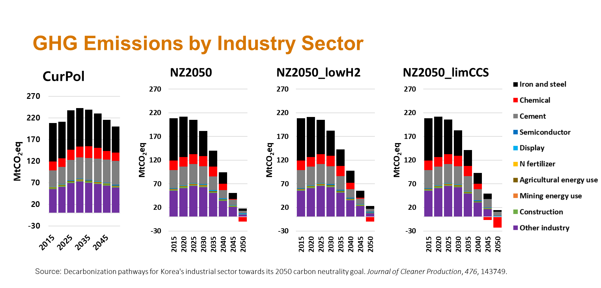
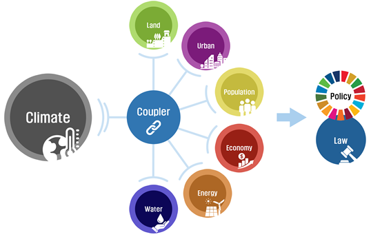
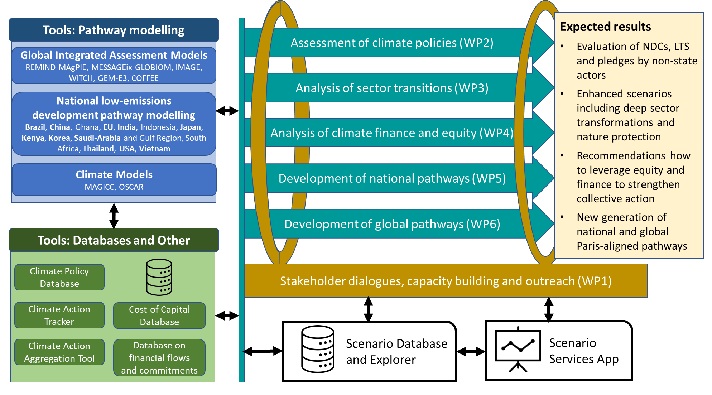

  

    
KAIST IAM Group

    <h1>Models & Projects</h1>
  

Our group develops and applies integrated assessment and energy system models to explore decarbonization pathways, climate policy, and sustainability transitions. We also contribute to collaborative research projects that connect modeling innovation with real-world policy decision support.

## Models

<h3><a href="https://github.com/JGCRI/gcam-core" target="_blank">GCAM-core</a></h3>
GCAM-core is an open-source integrated assessment model developed by the Joint Global Change Research Institute (JGCRI). It represents interactions among energy, water, land, economy, and climate systems, and is widely used for long-term scenario analysis of global change mitigation and adaptation.

<h3><a href="https://github.com/GCAM-KAIST/gcam-kaist7-release" target="_blank">GCAM-KAIST</a></h3>
GCAM-KAIST is the KAIST IAM Group's customized modeling framework based on GCAM. Our work focuses on improving the model's relevance for Korea and globally connected systems by incorporating country-specific assumptions, sectoral detail, and policy-relevant scenario design for sustainability and net-zero analysis.

## Projects

<h3>Net-Zero Korea (NZK)</h3>
Accelerating Energy and Industrial Decarbonization

The Net-Zero Korea (NZK) project is a landmark collaboration between the KAIST Graduate School of Green Growth and Sustainability and the Andlinger Center for Energy and the Environment at Princeton University. Supported by seed funding from Google, the initiative aims to accelerate the Republic of Korea's energy and industrial decarbonization through high-resolution modeling and policy decision support.

<h4>Collaborative Modeling Innovation</h4>
NZK adapts the pioneering modeling approach introduced in Princeton's <em>Net-Zero America</em> study, bringing greater granularity to the Korean context, including local land use, capital investment requirements, employment shifts, and air pollution health impacts.

<h4>Institutional Strengths</h4><ul><li><strong>Princeton expertise:</strong> high-resolution modeling frameworks for national and subnational planning.</li><li><strong>KAIST expertise:</strong> deep knowledge of the Korean socio-economic context, international trade, and global supply chains.</li></ul>

<h4>Project Goals</h4><ul><li><strong>Inform decision-making:</strong> create effective, data-driven tools to guide Korea's sustainable energy and industrial future.</li><li><strong>Global scalability:</strong> develop modeling capabilities for trade-exposed economies with strong global supply chain integration.</li><li><strong>Achieve net zero:</strong> support broader net-zero efforts through rigorous scientific analysis and multi-sectoral collaboration.</li></ul>

<h3>Geophysics-Human Interaction Model (GHIM)</h3>
AI-Based Next-Generation Integrated Assessment Modeling

In collaboration with MetaEarth Lab, the GHIM project aims to advance the Integrated Assessment Modeling (IAM) paradigm by developing a next-generation framework that explicitly simulates bidirectional feedbacks between the Earth system and human society. By leveraging AI and machine learning, the project addresses limitations of traditional one-way climate impact assessments.

<h4>Key Innovations & Framework</h4><ul><li><strong>Bidirectional interaction:</strong> simulating how socio-economic responses such as policy, migration, and trade feed back into the climate system.</li><li><strong>AI-enhanced sector models:</strong> resolving high-resolution complexity in water, food, energy, and urban systems.</li><li><strong>Comprehensive socio-economic analysis:</strong> incorporating demographic change, legal frameworks, and financial risk.</li></ul>

<h4>Our Objectives</h4><ul><li><strong>Technological leadership:</strong> develop IAM capabilities that strengthen climate research and policy support.</li><li><strong>Granular policy support:</strong> provide detailed analysis for water, food, and energy security.</li><li><strong>International contribution:</strong> contribute high-quality data to intercomparison exercises and IPCC-related efforts.</li></ul>

<h3>NEWPATHWAYS</h3>
Advancing Global and National Low-Emission Pathways

The KAIST IAM Group joined the NEWPATHWAYS project as an associate partner representing the Korean modeling team. Funded through the EU Horizon program, this 42-month initiative brings together 24 partner organizations across 18 countries to define next-generation transformation strategies for a sustainable future.

<h4>Our Mission within NEWPATHWAYS</h4>
The project aims to develop a scientific and socio-economic roadmap to limit global warming to well below 2 K, with a primary target of 1.5 K. By integrating advanced modeling with social science and economic perspectives, NEWPATHWAYS supports a sustainable, equitable, and just transition.

As an associate partner, the KAIST IAM Group contributes a critical South Korean perspective, helping ensure that global pathways are grounded in regional realities, transparency, and equity.

<h4>Key Research Objectives</h4><ul><li><strong>Next-generation modeling:</strong> establish transformation pathways that minimize temperature overshoot while protecting biodiversity and nature.</li><li><strong>Accountability & transparency:</strong> improve the clarity and consistency of GHG reduction commitments across governance levels.</li><li><strong>Equity and finance:</strong> identify opportunities to leverage international finance and equity principles for stronger climate action.</li></ul>

Learn more: <a href="https://newpathways.eu/" target="_blank">NEWPATHWAYS</a>

