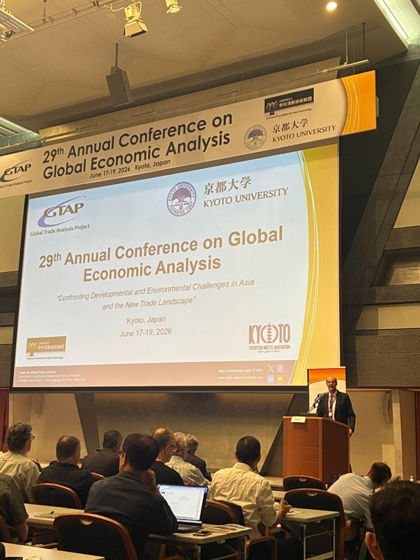
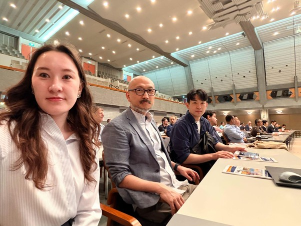
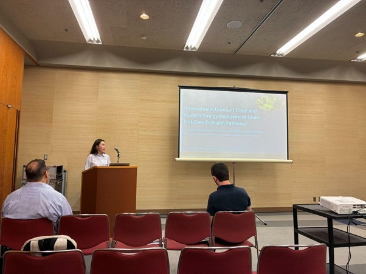
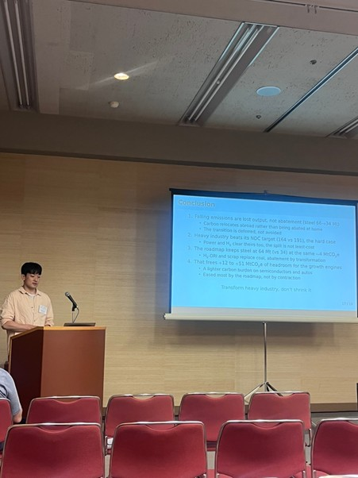
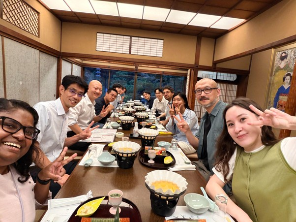

*The KAIST-IAM group participated in the 29th Annual Conference on Global Economic Analysis, held in Kyoto, Japan, from June 17 to 19, 2026.*

The conference brought together researchers from the GTAP community, computable general equilibrium (CGE) modeling, and related economy-wide and integrated assessment modeling fields to discuss global trade, climate policy, energy transitions, and sustainable development. Among the many sessions, discussions on national model-intercomparison projects in Asia offered a valuable opportunity to reflect on how development and environmental challenges shape energy transitions and net-zero pathways in countries such as Japan, Korea, and India.

As part of the KAIST-IAM group, **Medina Mukhamedina** presented International Uranium Trade and Nuclear Energy Deployment under Net-Zero Emission Pathways on June 18. The study analyzed how changes in Kazakhstan’s uranium supply conditions could affect the implementation of global net-zero pathways and generate impacts across multiple economic dimensions.

**Hyuntae Choi** presented The Impact of Manufacturing Competitiveness Erosion and Trade Regulation on Korea's 2035 NDC Pathway and Beyond on June 19. The study examined the implications of national, economy-wide impacts arising from output contraction in Korea’s heavy and chemical industries under weakening manufacturing competitiveness and trade regulation for the country’s 2035 NDC and the 2050 carbon-neutrality goal.

Beyond the formal sessions, the conference also provided a valuable opportunity to exchange ideas with researchers from around the world, including researchers from Kyoto University. Discussions during and after the conference helped broaden perspectives on integrated assessment modeling, trade analysis, and future collaboration.

{fig-align="center"}

{fig-align="center"}

{fig-align="center"}

{fig-align="center"}

**KAIST-IAM 그룹, 교토에서 열린 제29회 세계경제분석학회 참가**

KAIST-IAM 그룹은 2026년 6월 17일부터 19일까지 일본 교토에서 열린 제29회 세계경제분석학회(Annual Conference on Global Economic Analysis)에 참가하였다. 이번 학회 참가는 EU Horizon 공동 프로젝트인 「기후위기의 해결을 위한 새로운 경로 개발」 과제의 일환으로 이루어졌다.

이번 학회에는 GTAP 커뮤니티, 연산가능일반균형(CGE) 모형, 그리고 관련 경제 전반 모형 및 통합평가모형 분야의 연구자들이 모여 글로벌 무역, 기후정책, 에너지 전환, 지속가능발전 등 다양한 주제를 논의하였다. 특히 KAIST-IAM 그룹은 아시아 국가들의 모형비교연구와 관련된 논의에 참여하며, 개발 과제와 환경 문제가 일본, 한국, 인도 등 아시아 국가의 에너지 전환과 넷제로 경로에 어떤 영향을 미치는지에 대한 시각을 넓힐 수 있었다.

KAIST-IAM 그룹에서는 **Medina Mukhamedina**가 6월 18일 International Uranium Trade and Nuclear Energy Deployment under Net-Zero Emission Pathways를 발표하였다. 해당 연구는 카자흐스탄의 우라늄 공급 조건 변화가 글로벌 넷제로 경로의 이행과 경제의 여러 측면에 미치는 영향을 분석하였다.

또한 **최현태 박사**는 6월 19일 The Impact of Manufacturing Competitiveness Erosion and Trade Regulation on Korea's 2035 NDC Pathway and Beyond를 발표하였다. 이 연구는 제조업 경쟁력 약화와 무역규제로 인해 한국 중화학공업 부문에서 생산 축소가 발생할 경우, 이러한 변화가 국가 경제 전반에 미치는 영향과 2035 NDC 및 2050 탄소중립 목표에 갖는 함의를 분석하였다.

이번 교토 학회는 KAIST-IAM 그룹이 진행 중인 연구를 국제 연구 커뮤니티와 공유하고, 학회장 안팎에서 논의를 이어가며 통합평가모형, 경제와 무역 및 토지 정책, 기후 연구에 대한 시각을 넓히고 향후 공동 연구 가능성을 모색하는 뜻깊은 시간이 되었다.
