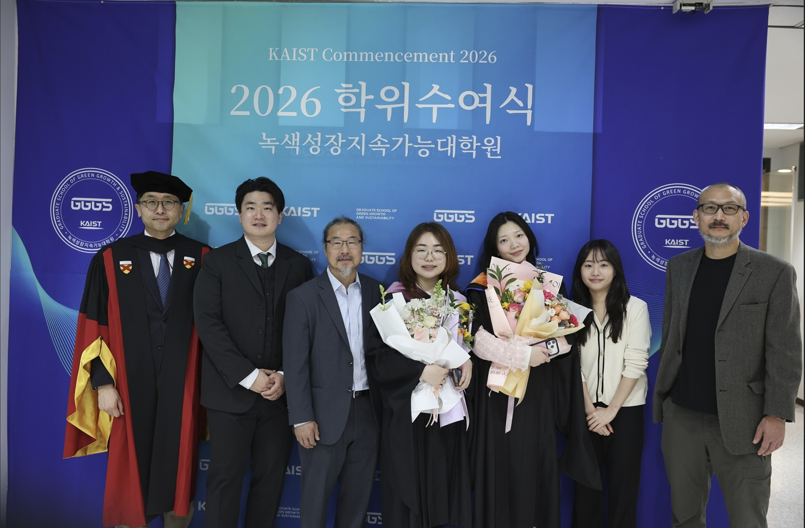

*KAIST IAM Group proudly congratulates our members Jungme, Jiwon, and Jiheun on their graduation. We thank them for their contributions to the group and wish them all the best in their next steps.*

{fig-align="center" width="650"}

### Jungme Lee

Jungme Lee completed her **M.S. in Green Growth and Sustainability** at KAIST. Her research focused on estimating carbon price levels aligned with Korea’s 2050 carbon neutrality target, providing insights for future carbon pricing design.

She has joined **Kia Corporation**, where she works on sustainability-related initiatives.

> “I feel relieved and happy to have completed my research. It’s a great feeling to have everything wrapped up, and I’m excited for what lies ahead in this next chapter of my life.”

---

### Jiwon Kwun

Jiwon Kwun completed her **M.S. in Business and Technology Management** at KAIST. Her research explored energy transition scenarios using Integrated Assessment Models, with a focus on hydrogen systems and energy security.

She continues her academic journey as a **PhD student in the Graduate School of Green Growth and Sustainability** at KAIST.

> “Working with IAMs helped me better understand how complex energy transitions are and how different solutions, like hydrogen, fit together. It also motivated me to continue my research and pursue a PhD.”

---

### Jiheun Ha

Jiheun Ha completed her **B.S. in Transdisciplinary Studies and Biological Sciences** at KAIST. Her interests include climate policy, subnational strategies, and climate justice within integrated assessment modeling.

She continues her studies as a **Master’s student in the Graduate School of Green Growth and Sustainability** at KAIST.

> “Being part of the IAM Group helped me see how climate policy connects to real-world challenges and helped shape my research interests. It also encouraged me to continue exploring this field in my graduate studies.”

---

Congratulations once again to Jungme, Jiwon, and Jiheun. We look forward to their continued achievements.