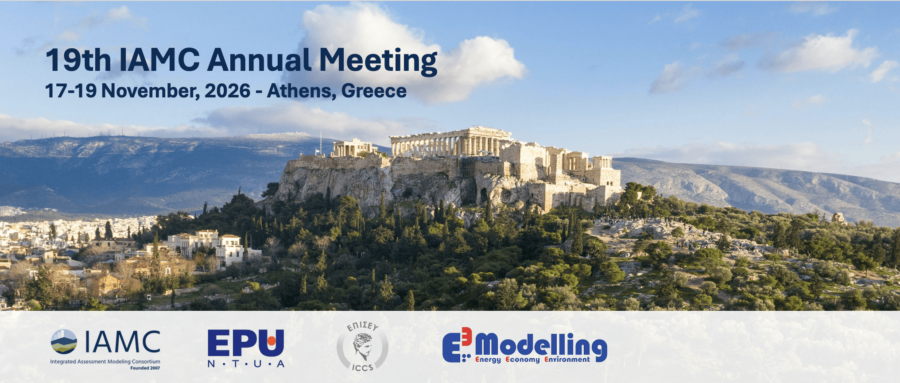

*The KAIST IAM Group is proud to announce that seven abstracts from our members have been accepted for presentation at the 19th Annual Meeting of the Integrated Assessment Modeling Consortium (IAMC), to be held in November 2026 in Athens, Greece.*

This achievement reflects the dedication and innovative research of our group.

{fig-align="center"}

**Oral Presentations:**

- Lead Author: Hyuntae Choi
Title: Sectoral net-zero roadmaps can resolve the twin burden of competitiveness erosion and trade regulation: an integrated assessment using GCAM-ROK (#133)

- Lead Author: Rachel Kim (in collaboration with Princeton University)
Title: TITLE (#XXX)

- Lead Author: Jiheun Ha
Title: Estimating the Emission Impact of Subnational Climate Actions in Korea's 17 Provinces using GCAM (#273)

- Lead Author: Yen Shin ([U&I Lab at KAIST](https://uilab.kr/)), with Jiheun Ha and Haewon McJeon (KAIST IAM Group) as co-author and corresponding author
Title: ML-IAM v1.0: Emulating Integrated Assessment Models With Machine Learning (#280)

**Poster Presentations:**

- Lead Author: Jin Lee
Title: 2050 Net-Zero Transition in Korea: Assessing the GDP Impact of Nuclear Power Using GCAM-Macro (#75)

- Lead Author: Jiseok Ahn
Title: Energy System and Climate Implications of AI Data Center Growth: Evidence from the Global Change Analysis Model (#104)

- Lead Author: Jiwon Kwun
Title: Modeling International Trade Dynamics of Clean Ammonia for Fuel and Fertilizer Use Under a Net-Zero Transition in Korea (#366)

We extend our congratulations to all authors and contributors whose hard work has been recognized. Their research will contribute to the global discussion on integrated assessment modeling, energy, and climate policy. We look forward to seeing their presentations at the IAMC Annual Meeting in Athens!
