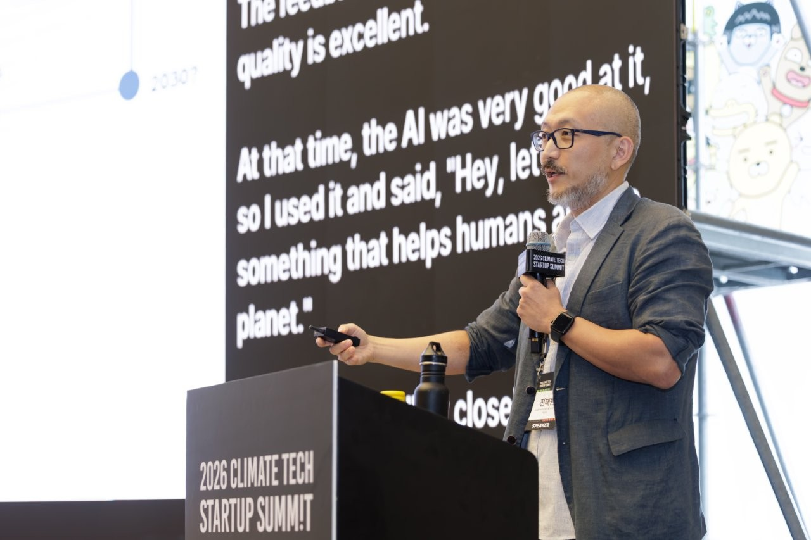
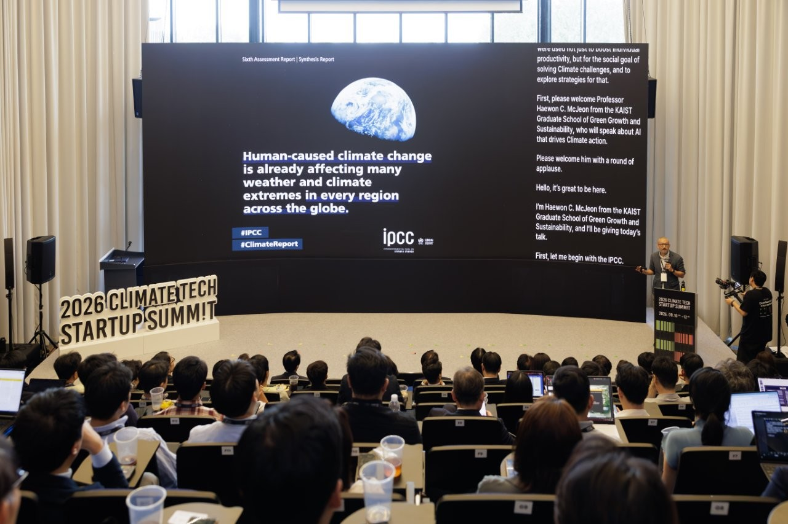
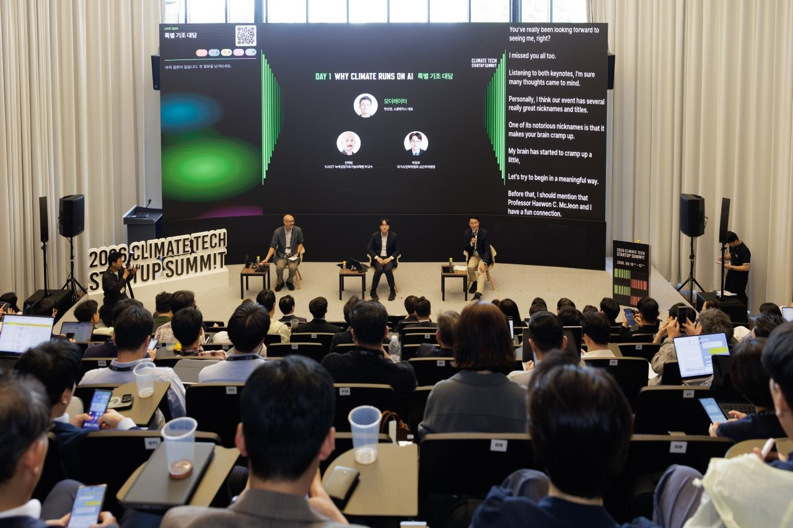
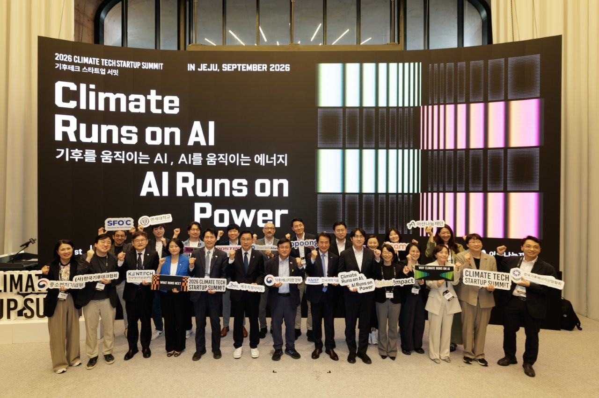

*Prof. Haewon C. McJeon gave a keynote address at the 2026 Climate Tech Startup Summit in Jeju on September 10, 2026.*

In his keynote, Prof. McJeon focused on two questions: Can AI predict climate change pathways? And will the growing use of AI increase emissions? After the keynote, he joined Jung-Woo Ha, Standing Vice Chair of the National AI Strategy Committee, for a conversation on climate change and AI, moderated by Sangyeop Han, CEO of Sopoong Ventures.

The [Climate Tech Startup Summit](https://impactclimate.net/ctss/2026/) is an annual event hosted by Kakao Impact and Sopoong Ventures since 2022. It brings together climate tech founders, investors, policymakers, and researchers. This year's summit, the fifth, ran from September 10 to 12 under the theme "Climate Runs on AI, AI Runs on Power."

- Related news (Yonhap): <https://n.news.naver.com/article/001/0016308418?sid=105>

{fig-align="center"}

{fig-align="center"}

{fig-align="center"}

{fig-align="center"}

**카이스트 전해원 교수, 2026 기후테크 스타트업 서밋 기조발제**

카이스트 녹색성장대학원 전해원 교수가 9월 10일 제주에서 열린 「2026 기후테크 스타트업 서밋」에서 기조발제를 맡았다.

전 교수는 'AI로 기후변화 경로를 예측할 수 있을까', 'AI를 많이 쓰면 배출량이 늘어날까'라는 두 질문을 중심으로 발제했다. 발제를 마친 뒤에는 한상엽 소풍벤처스 대표의 사회로 하정우 국가인공지능전략위원회 상근부위원장과 기후변화와 AI를 주제로 대담을 나눴다.

[기후테크 스타트업 서밋](https://impactclimate.net/ctss/2026/)은 카카오임팩트와 소풍벤처스가 2022년부터 해마다 여는 초청제 행사로, 기후테크 창업자와 투자자, 정부·정책 전문가, 연구자가 한자리에 모인다. 다섯 번째인 올해 서밋은 "Climate Runs on AI, AI Runs on Power(기후를 움직이는 AI, AI를 움직이는 에너지)"를 주제로 9월 10일부터 12일까지 사흘간 열렸다.

- 관련 기사(연합뉴스): <https://n.news.naver.com/article/001/0016308418?sid=105>
