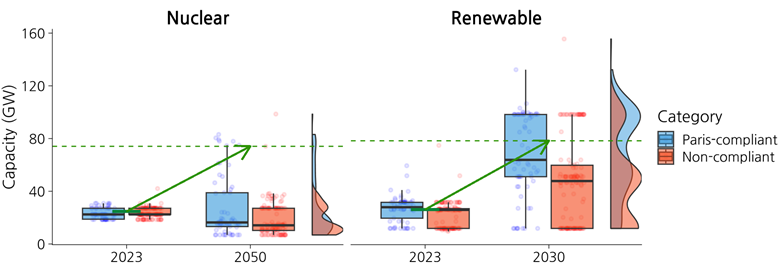

*A new study published in iScience by researchers from KAIST and the Korea Institute of Energy Research investigates how Korea’s plan to triple renewable and nuclear energy capacity aligns with global decarbonization trajectories derived from the IPCC’s Sixth Assessment Report (AR6) scenario database.*

{fig-align="center"}

The research comes at a time of accelerating global momentum toward carbon neutrality, following the UNFCCC international agreement in which nearly 200 countries pledged to triple renewable energy capacity and double energy efficiency by 2030. Published in 2025, Korea’s 11th Basic Plan for Long-Term Electricity Supply and Demand (2024–2038) incorporates these targets into its national energy roadmap, emphasizing large-scale deployment of solar, wind, and next-generation nuclear technologies such as SMRs.

To evaluate the consistency of Korea’s future energy mix with global mitigation pathways, the authors analyzed 198 quantitative scenarios that include Korea as a reporting region within the IPCC AR6 scenario database. These scenarios represent a wide range of long-term energy system transformations, from high-fossil pathways to deep-decarbonization trajectories consistent with the Paris Agreement.

The results reveal that Korea’s renewable energy expansion is broadly aligned with Paris-compliant pathways, confirming that the country’s policy direction is in line with international efforts to scale up clean renewable electricity. However, the study finds that the pace of fossil-fuel reduction and the planned expansion of nuclear power diverge from Paris-compliant scenarios’ projections. In particular, 29% of Paris-compliant scenarios achieve renewable capacity levels consistent with the tripling goal by 2030, compared to only 4% of Paris-compliant scenarios reach the nuclear tripling target by 2050, suggesting that large-scale nuclear expansion remains relatively rare across scenarios projections. Moreover, the interquartile range (IQR) of renewable capacity is notably higher in Paris-compliant scenarios than in non-compliant ones, reflecting a broader and more ambitious deployment range. In contrast, the IQR for nuclear capacity shows no significant difference between the two groups, suggesting a generally limited variation in nuclear expansion assumptions.

{fig-align="center"}

The study concludes that Korea’s transition based on international clean energy pledges exhibits “partial consistency” with Paris-aligned trajectories—aligned in direction but slower in magnitude. To close this gap, the authors recommend accelerating the coal phaseout, limiting the expansion of gas-fired capacity, and strengthening policy coordination between renewable and nuclear energy strategies to ensure a more coherent and balanced clean energy transition.

“Tripling clean energy capacity is an ambitious and positive signal,” said Jiseok Ahn of KAIST School of Business and Technology Management. “Yet, achieving full alignment with Paris-consistent pathways requires faster reduction of fossil-fuel reliance, balanced expansion of clean energy technologies, stronger integration of science-based scenario modeling into national planning processes.”

The authors emphasize that future research should incorporate updated technologies and recent national policy developments to ensure that global scenario databases more accurately reflect evolving national energy strategies. Strengthening the link between global models and country-specific contexts will enhance the credibility, comparability, and policy relevance of international climate scenario analyses.

Paper link: <http://doi.org/10.1016/j.isci.2026.115305>

**한국의 ‘재생에너지·원전 3배 확대’ 목표, 파리협정 목표 달성을 위한 감축 경로와 정합도 분석**

한국과학기술원과 한국에너지연구원 공동연구팀은 국제학술지 iScience에 발표한 연구에서, 한국이 유엔기후변화협약 당사국총회에서 제시한 ‘재생에너지 2030년까지 3배 확대, 원전 2050년까지 3배 확대(tripling)’ 목표가 IPCC 제6차 평가보고서(AR6)에 포함된 감축 시나리오와 얼마나 정합성을 갖는지를 정량적으로 분석했다.

이번 연구는 2050 탄소중립을 향한 글로벌 전환이 가속화되는 가운데, 한국의 탄소중립 정책이 글로벌 파리협정 정합 시나리오와 어떤 차이를 보이는지를 비교한 체계적 분석이다. 연구진은 IPCC AR6 시나리오 데이터베이스에 포함된 총 198개 시나리오를 활용하여 한국의 전력부문 발전설비 경로를 추출하고, 이를 온도상승 수준에 따라 파리협정 정합(Paris-compliant)과 비정합(non-compliant) 시나리오로 분류했다.

분석 결과, 유엔기후변화협약의 재생에너지 3배 확대 목표는 파리협정 목표 달성을 위한 시나리오에서의 재생에너지 확대 경로와 대체로 유사한 추세를 보여 29% 정도의 시나리오가 확대 목표를 달성하였으나, 화석연료 감축 속도와 원전 확대 수준에서는 차이가 있었다. 특히 원전의 경우 3배 확대 목표를 달성하는 시나리오는 4% 정도로 매우 제한적이었다.

연구진은 이를 두고 “부분적 정합성(partial consistency)”이라고 설명하며, 국내 에너지 정책이 방향성은 글로벌 감축목표와 일치하나 속도와 구조 측면에서 개선 여지가 있다고 분석했다. 향후 정책적 정합성을 높이기 위해서는 ▲탈석탄의 가속화, ▲가스 설비 의존도 완화, ▲재생에너지-원자력 발전의 균형 잡힌 확대 등을 통한 전력믹스 최적화 전략이 필요하다고 제안했다.

연구를 주도한 KAIST 기술경영학부 박사과정 안지석 연구원은“재생에너지와 원전의 3배 확대는 기후위기 대응 의지를 보여주는 긍정적 신호지만, 실질적으로 지구 온도 상승 억제를 위해서는 화석연료 의존에서 빠르게 벗어나는 동시에 균형 잡힌 청정에너지 보급과 확산, 과학적 시나리오 모델링 기반의 정책결정 체계를 강화할 필요가 있다”고 강조했다. 연구진은 기후위기에 과학적 대응을 위해서는 국가별 정책 변화와 기술 변화를 반영한 시나리오 체계의 확충이 필요하다고 제안하며, 이를 통해 글로벌–국가 간 정책 정합성 분석의 신뢰도를 높일 수 있을 것이라고 덧붙였다.

논문 링크: <http://doi.org/10.1016/j.isci.2026.115305>
