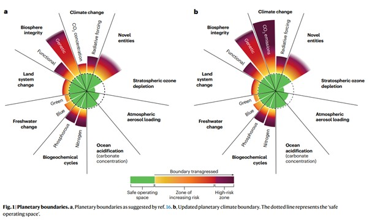
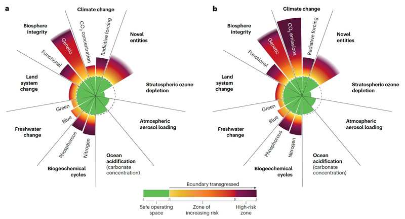
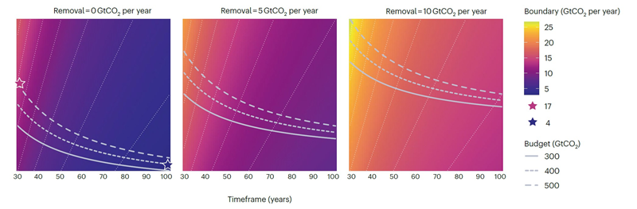

*The planetary boundaries framework sets quantitative limits on how much pressure human activities can place on Earth while keeping the climate and ecosystems in a stable, Holocene-like state.*

{fig-align="center" width="650" height="420"}

In this framework, the climate boundary is usually defined as a “stock” — the concentration of CO₂ in the atmosphere — whereas the nitrogen and phosphorus boundaries are defined as “flows,” such as tons of nutrient pollution released each year. New joint research conducted by KAIST Graduate School of Green Growth & Sustainability and the Joint Global Change Research Institute proposes a unified, flow-based definition of the climate boundary and shows that, under a consistent method, climate change has already far surpassed its safe boundary, even more than nitrogen and phosphorus pollution.

The planetary boundaries framework has become a widely used tool in Earth system science, highlighting that Earth’s resilience has clear limits. However, the biogeochemical boundaries for climate change, nitrogen, and phosphorus have not been defined on a consistent basis. A new perspective paper published in Nature Sustainability re-examines these three boundaries using a unified, flow-based metric and finds that, when assessed in the same way, the climate boundary is the most heavily exceeded.

In existing planetary boundary assessments, climate change is typically expressed as atmospheric CO₂ concentration, radiative forcing, or global temperature rise — all stock-type indicators that reflect the cumulative buildup of greenhouse gases. In contrast, the nitrogen and phosphorus boundaries are expressed as annual flows of reactive nitrogen (about 62–82 Tg N per year) and phosphorus (about 11–100 Tg P per year) that can be safely released to the environment.

This study redefines the climate boundary in analogous, flow-based terms: the annual CO₂ emissions compatible with limiting warming to 1.5°C, given the remaining global carbon budget and assumptions about CO₂ removal. Under plausible assumptions, this translates to a safe range of roughly 4–17 Gt CO₂ per year, whereas current human-caused CO₂ emissions are about 37 Gt CO₂ per year. On this consistent scale, current emissions overshoot the climate boundary by approximately 3–4 times. Seen on this consistent scale, the climate change problem is found to be far exceeding the safe boundary compared to nitrogen and phosphorus, highlighting the need to prioritize rapid CO₂ reductions.

“The planetary boundaries framework provides a valuable guide for keeping humanity within a safe operating space on Earth,” said Prof. Haewon McJeon of the KAIST Graduate School of Green Growth and Sustainability. “However, the climate change boundary has not been measured consistently with the nitrogen and phosphorus boundaries. When this inconsistency is corrected, it becomes clear that climate change is already beyond the safe operating space, underscoring the urgent need to accelerate global decarbonization efforts.”

By expressing climate change, nitrogen, and phosphorus on the same flow-based measurements, this study shows that solving climate change is more urgent than previously estimated by the planetary boundary literature. A more consistent methodology can support clearer communication, better-aligned global priorities, and integrated strategies that tackle climate change and biogeochemical pollutions together.

Paper link: <https://doi.org/10.1038/s41893-026-01770-6>

**한국어 요약**

**KAIST, “지구 안전선 이미 넘었다”...탄소 배출 한계 두 배 초과**

-   KAIST-미국 에너지부 산하 태평양북서부국립연구소(PNNL), 지구가 감당할 수 있는 탄소 한계 재계산

-   질소 오염과 동일한 ‘연간 배출량’ 기준 적용...현재 배출량, 안전 범위 두 배 이상 초과

-   기후 위기 심각성 재확인...전 세계 탄소중립 가속화 필요성 제시

지구는 무한하지 않다. 일정 수준을 넘는 오염은 기후와 생태계를 위협한다. 과학자들은 이를 막기 위해 ‘플래니터리 바운더리(Planetary Boundaries)’라는 지구 안전선을 제시해 왔다. KAIST 연구진이 기후변화와 질소 오염을 같은 기준으로 다시 계산한 결과, 현재 탄소 배출은 지구가 감당할 수 있는 한계를 두 배 이상 넘은 상태로 나타났다.

KAIST(총장 이광형)는 녹색성장지속가능대학원 전해원 교수가 미국 에너지부 산하 태평양북서부국립연구소(PNNL)의 폴 울프람(Paul Wolfram) 박사팀과 공동 연구를 통해, 이산화탄소 배출 한계를 기존의 ‘탄소 총량(저량, stock)’ 기준에서 질소·인 오염과 같은 ‘연간 배출량(유량, flow)’ 기준으로 재산정했다고 6일 밝혔다.

그동안 기후변화는 대기 중에 얼마나 CO₂가 쌓였는지(저량)를 기준으로 평가해 왔다. 반면 질소·인 오염은 1년에 얼마나 배출되는지(유량)를 기준으로 계산했다. 서로 다른 잣대를 사용하다 보니 어떤 문제가 더 심각한지 공정하게 비교하기 어려웠다. 연구팀은 탄소 역시 질소와 동일한 ‘연간 배출량’ 기준으로 다시 계산했다.

지구 평균 온도 상승을 1.5°C 이내로 제한하는 조건에 맞춰 분석한 결과, 지구가 감당할 수 있는 연간 CO₂ 배출 한계는 약 ‘4\~17기가톤(Gt CO₂/년)’으로 나타났다. 그러나 현재 인류의 연간 배출량은 약 ‘37기가톤(Gt CO₂/년)’에 달한다. 이는 지구의 안전 작동 범위를 두 배 이상 초과한 수준이다.

전해원 교수는 “탄소 배출을 질소 오염과 같은 기준으로 비교하면 기후변화의 심각성이 훨씬 더 분명하게 드러난다”며 “이번 연구는 서로 다른 환경 문제를 동일한 기준에서 바라볼 수 있게 해 정책 우선순위를 보다 명확히 정하는 데 기여할 것”이라고 말했다.

이어 “탄소와 질소·인 오염을 함께 고려한 통합적 전략 수립의 필요성도 더욱 커지고 있다”며 “전 세계적인 탈탄소화 노력을 한층 더 가속해야 한다”고 강조했다.

이번 연구는 전해원 교수와 폴 울프람(Paul Wolfram) 박사가 공동 교신으로 총괄하였으며, 미국 PNNL 연구원 하싼 니아지(Hassan Niazi)와 페이지 카일(Page Kyle) 등이 공동연구에 참여했다. 연구 결과는 국제 학술지 ‘네이처 서스테인어빌리티(Nature Sustainability)’에 2월 16일 자 게재되었다.

-   **연구개요**

1.  **연구 배경**

플래니터리 바운더리(Planetary Boundaries) 프레임워크는 인류 활동이 지구 시스템에 가할 수 있는 압력을 정량화해 홀로세(Holocene)와 유사한 안정 상태를 유지하기 위한 ‘안전 작동 한계’를 제시한다. 하지만 현재의 평가에서는 지구가 지탱할 수 있는 기후변화의 한계를 대기 중 CO₂ 농도, 복사 강제력(radiative forcing), 전 지구 평균 기온 상승 등 누적 축적을 반영하는 ‘저량(stock)’ 지표로 정의하는 반면, 질소·인 등 바이오지오케미스트리 오염의 한계는 환경에 방출되는 연간 오염량과 같은 ‘유량(flow)’ 지표로 정의한다. 이러한 비교 방식의 불일치가 경계 간 상대적 위험 수준의 측정을 왜곡한다는 문제에 착안하여 , 본 연구는 탄소·질소·인을 동일한 유량 기반 지표로 재정의해 일관된 비교를 수행하였다

2.  **연구 내용**

연구팀은 남아 있는 전 지구 탄소 예산과 미래 탄소 제거 가능량을 바탕으로, 지구 평균 온도 상승을 1.5°C 이내로 제한하는 데 부합하는 ‘연간 CO₂ 배출량’을 새로운 기후변화의 한계선의 기준으로 제시하였다. 그 결과, 안전한 연간 CO₂ 배출 범위는 약 4–17 Gt CO₂/년으로 추정되는 반면, 현재 인류의 CO₂ 배출량은 약 37 Gt CO₂/년에 달해 기후 경계를 약 3–4배 초과하는 것으로 나타났다. 또한 남아 있는 탄소 예산, 목표 달성 시점(시간 프레임), CO₂ 제거 수준 및 비-CO₂ 온실가스 고려 여부에 따라 유량 기반 탄소 배출의 한계가 달라질 수 있음을 민감도 분석으로 제시했다.

3.  **기대 효과**

본 연구는 탄소·질소·인을 동일한 유량 단위로 표현함으로써, 플래니터리 바운더리 측정의 새 기준을 제시하였으며, 일관된 기준에 따른 비교 평가를 가능하게 하였다. 이를 통해 기후변화의 위험도가 기존 플래니터리 바운더리 연구에서 과소평가 되어 왔던 것에 비해 더 시급한 문제임을 보여주며, 전 지구적 환경문제 해결의 우선순위 재정렬과 탈탄소화 정책 가속의 필요성을 뒷받침한다. 나아가 기후변화와 바이오지오케미컬 오염의 상호작용을 고려한 통합적 전략 수립에도 기초 근거를 제공할 수 있다.

-   **그림 설명**

{fig-align="center"}

기존 플래니터리 바운더리에서는 기후변화가 저량(stock) 지표(대기 중 CO₂ 농도 또는 복사 강제력)로 제시되는 반면, 질소·인 배출의 한계는 연간 유량(flow) 지표로 제시된다. 본 연구는 탄소 배출의 한계를 ‘연간 배출량’으로 재정립하여 경계 간 정량적 비교의 일관성을 확보하였다.

남아 있는 전 지구 탄소 예산, 목표 달성까지의 시간 프레임, 탄소 제거 수준, 비-CO₂ 온실가스 고려 여부에 따라 유량 기반 기후 경계가 달라질 수 있음을 보여준다. 이에 따른 안전한 연간 CO₂배출 한계(약 4–17 Gt CO₂/년) 대비 현재 배출량(약 37 Gt CO₂/년)의 초과 수준을 정량적으로 제시한다.

논문링크: <https://doi.org/10.1038/s41893-026-01770-6>

-   주요 보도 기사 보기

1\. 연합뉴스: <https://lnkd.in/g-HM5zmQ>

2\. 한국경제: <https://lnkd.in/gDEY_RWb>

3\. 서울신문: <https://lnkd.in/g4r-te9k>

4. 헤럴드경제: <https://lnkd.in/gQJmz7nn>

5\. 파이낸셜뉴스: <https://lnkd.in/gSsU7ztk>

6\. 전자신문: <https://lnkd.in/gKPECT6x>

7\. 충남일보: <https://lnkd.in/gzRrhamU>

8\. 뉴스1: <https://lnkd.in/geeT6DHg>

9\. 경향신문: <https://lnkd.in/gx62EqEs>

10\. 동아사이언스: <https://lnkd.in/gk45Dv29>
