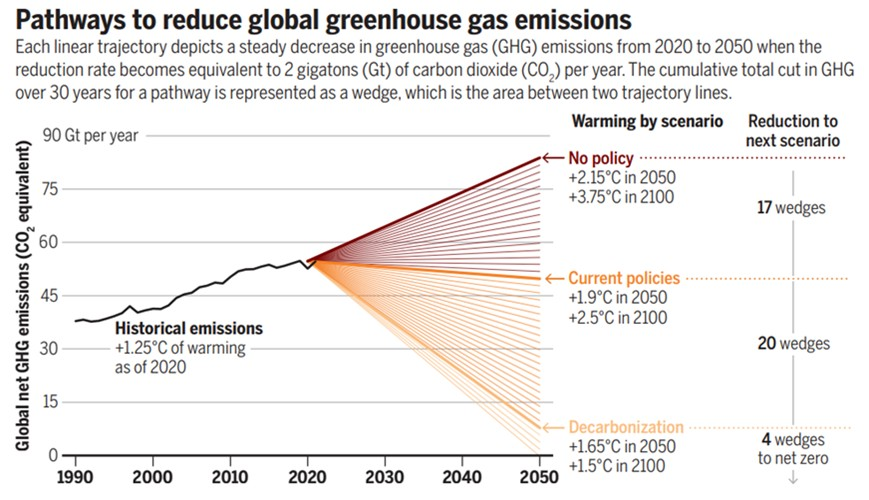

*Twenty years after the revolutionary simple “climate stabilization wedges” concept was first introduced to fundamentally change how we visualize the climate challenge, a new study reflected on a 20-year history of this framework in a new perspective article in Science.*

{fig-align="center"}

Twenty years after the revolutionary simple “climate stabilization wedges” concept was first introduced to fundamentally change how we visualize the climate challenge, Prof. Haewon McJeon of the Graduate School of Green Growth and Sustainability at KAIST and Prof. Yang Ou of Peking University have reflected on a 20-year history of this framework in a new perspective article in *Science*. In the article titled "36 Solutions to Stabilize Earth’s Climate," the authors look back at how a simple stabilization concept evolved into a participatory communications tool for the global net-zero emissions.

**Reflecting on a 20-Year Journey**

The perspective looks back to 2004, when the original "stabilization triangle" suggested that the world needed only seven "wedges" of emissions reductions to avoid the worst effects of climate change. Reflecting on the two decades since, Prof. McJeon notes that the task has grown in both scale and urgency. With global fossil CO2 emissions hitting a record high of 42 Gt in 2024, the key difference is a sobering one: due to inaction in decarbonization, the 50-year runway envisioned in 2004 has been compressed into a 25-year sprint to 2050.

Fast forward to 2026, the authors evaluate how the modernized wedges framework, developed by Johnson and Staffell, has matured to meet this challenge. By standardizing a single "wedge" as 2 GtCO2 per year of avoided emissions by 2050, the new wedges framework is made more comprehensive and flexible:

-   **A Mirror to Diverse Portfolios:** The original handful of solutions has blossomed into 36 strategies spanning electricity, transport, industry, buildings, and land use—reflecting the vast technological progress of the last two decades.

-   **Reflecting Societal Values:** A central theme of the wedges framework is "Democratic Choice." To limit warming to 1.5°C, only 20 of these 36 strategies are needed. This creates over 6 trillion possible combinations, indicating a research shift toward allowing each user to choose pathways that align with their values and preferences.

-   **Expanding the Scope:** The new framework now includes a broader set of "climate solution" by including behavioral shifts like reduced meat consumption alongside technological fixes.

**Bridging Science and Political Will**

Prof. McJeon notes that while complex Integrated Assessment Models (IAMs) have become essential for technical validation, the simple "wedges" framework remains a useful tool for transparent public discourse. This synergy shows a more mature understanding of climate governance: societies must design preferred pathways that are both socially endorsed and scientifically rigorous.

"Looking back at twenty years of research, the binding constraint was never a technological 'moonshot' but implementation," says Prof. McJeon. "The solutions have been available for more than a decade. What remains is the political will to mobilize finance, reform permitting, and maintain the mandate to act. Wedges excel at clarity and accessibility, helping stakeholders construct options that IAMs can then test for technical feasibility."

### About the Authors

**Prof. Haewon McJeon** is a leading expert in the decarbonization of the energy sector at the Graduate School of Green Growth and Sustainability, KAIST. His work focuses on the intersection of technology, economics, and policy. **Prof. Yang Ou** is a leading expert in the integrated assessment modeling of emissions at the College of Environmental Sciences and Engineering, Peking University.

### Links

-   Link to Publication: <https://www.science.org/doi/10.1126/science.aed5212>

 

\<한국어 요약\>

**기후 위기 극복을 위한 36가지 솔루션**

지구 기후를 안정화하기 위해 필요한 변화를 가장 단순화 하여 제시한‘기후 안정화 웨지 (climate stabilization wedge)’ 프레임워크가 처음 소개된 지 20년이 지난 지금, KAIST 녹색성장지속가능대학원의 전해원 교수와 베이징대학교의 양오우 교수가 지난 20년간의 기후 안정화 노력에 대한 해설을 Science 저널에 게재하였다. 저자들은 복잡한 기후 과학을 단순화한 웨지개념이 어떻게 전 지구적 탄소중립 달성을 위한 참여형 커뮤니케이션의 도구로 진화했는지 되짚어보았다.

2004년으로 거슬러 올라가는 기후 안정화라는 개념은 기후변화의 최악의 영향을 피하기 위해단 7개의 배출 감축 ‘웨지’만 필요하다고 제시했다. 그러나 20년이 지난 지금, 전해원 녹색성장지속가능대학원 교수는 그 과제의 규모와 시급성 모두가 크게 확대되었음을 지적한다. 2024년 전 지구 화석연료 CO2 배출량이 42Gt이라는 기록적인 수치를 기록한 가운데, 기존의 ‘50년’이라는 준비기간은, 지난 20년간 지지부진한 온실가스 감축으로 인해 단 25년이라는 짧은 시간만이 남겨진 인류 코앞에 닥친 문제로 다가왔다.

오늘날 2026년, 전해원 교수는 Johnson과 Staffell에 의해 발전된‘현대화된 웨지 프레임워크’가 이러한 도전에 어떻게 대응할 수 있도록 진화해 왔는지를 평가했다. 이 새로운 웨지 체계는 하나의 ‘웨지’를 2050년까지 연간 20억톤의 배출을 감축하는 단위로 표준화함으로써, 새로운 웨지 체계의 핵심 특징은 다음과 같다:

-   **36개의 감축 전략**

    전력, 수송, 산업, 건물, 토지 이용 등 전 부문에 걸친 36가지 전략이 제시된다. 기술 발전과 정책 옵션의 확장을 반영하고 있다.

-   **사회적 가치 반영**

    지구온난화를 1.5°C로 제한하기 위해서는 이 36개 전략 중 단 20개만이 현실화될 필요가 있다. 이는 각 이해당사자가 자신들의 가치와 우선순위에 맞는 맞춤형 감축 전략을 세울 수 있는 연구 방향의 전환을 보여준다.

-   **기술을 넘어선 범위의 확장**

    재생에너지·전기화 같은 기술적 해법뿐 아니라, 육류 소비 감소, 음식물 쓰레기 감축과 같은 행동 변화, 재조림·산림 보호 같은 자연기반해법도 명시적으로 포함된다.

저자들은 통합평가모형(IAM)이 기술적 타당성과 시스템 상호작용을 분석하는 데 필수적인 도구임을 강조한다. 동시에, 이러한 거대 모델만으로는 사회적 합의와 정치적 실행력을 만들어내기 어렵다는 점도 지적한다.

전해원 녹색성장지속가능대학원 교수는 “지난 20년간의 연구를 돌아보면, 제약 요인은 기술 혁신이 아니라 실행이었다”고 말한다. “해법은 이미 수십년간 존재해 왔다. 지금 필요한 것은 이를 실행하기 위한 재원의 투입과, 인허가 제도의 개혁, 그리고 기후 안정화를 행동으로 옮길 수 잇는 정치적인 의지와 사회적 합의이다. 기후 웨지 프레임워크는 명확성과 접근성 면에서 강점을 지니며, 이해관계자들이 다양한 선택지를 구성하도록 돕고, 구성된 경로를 통합평가모형(IAM)이 기술적 타당성 측면에서 검증할 수 있게 해준다”

-   논문링크: <https://www.science.org/doi/10.1126/science.aed5212>
