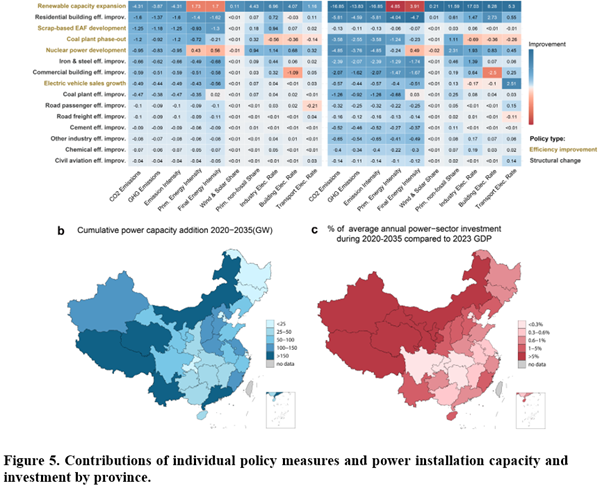

*As the growing global emphasis on credible climate action, an international research consortium including Peking University, Tsinghua University, University of Maryland, and KAIST published a study evaluating China's "1+N" climate policy framework. This study provides a critical analytical framework linking top-down national targets with bottom-up sectoral implementation capacities.*

{fig-align="center"}

This research systematically evaluates how national strategies and sectoral energy measures function within the actual implementation path to achieve China’s 2060 carbon neutrality goal. The researchers conducted a comprehensive review of 38 policy documents issued between 2019 and 2024 to build a robust database. To quantify these policies, the team extracted targets across 15 categories, such as renewable capacity expansion and energy efficiency standards, and integrated them into the GCAM-China-v6.0 model. This model disaggregates China's energy-economic system into 31 province-level sub-regions, accurately reflecting regional variations in resource potential and economic conditions.

Building on this analysis, the team reveals that under a "Continued" policy strengthening scenario, China’s non-fossil energy share is projected to reach 44% by 2035. This trend is largely consistent with the long-term trajectory required to reach carbon neutrality by 2060. While energy structure policies, such as renewable energy expansion, contribute most significantly to emission reductions, energy efficiency improvement measures play a vital role in managing energy intensity and maintaining economic productivity. However, the study estimates that cumulative power sector investments must exceed \$13 trillion by 2060. Notably, in several western provinces, the annual investment requirements are comparable to more than 5% of their 2023 GDP.

This highlights a significant imbalance and equity issue between national mitigation responsibilities and regional fiscal capacities. The study emphasizes that detailed policy design, integrating regionally adaptive strategies and economic feasibility, is essential for bridging national climate ambitions with actual sectoral execution. It provides an actionable roadmap for a sustainable and inclusive transition.

"As the U.S. withdraws from the Paris Agreement and concerns grow over a potential global rollback of climate commitments, China is silently yet steadily advancing its own strategy to reduce greenhouse gas emissions,” said Prof. Haewon McJeon of KAIST Graduate School of Green Growth and Sustainability. “This research provides a timely map of 'the Chinese way' of decarbonization— an approach that prioritizes industrial policy as the primary drivers of change, distinguishing it from the market-based carbon pricing models favored by the West. Ultimately, time will tell if this approach can make China as the new global benchmark for effective climate policy."

Paper link: <https://doi.org/10.1021/acs.est.5c11232>

**중국의 기후 목표와 감축 역량을 연결하는 부문별 정책 실행 연구**

최근 전 세계적으로 기후 위기 극복을 위한 실질적인 이행이 강조되는 가운데, 북경대, 칭화대, KAIST로 구성된 국제 공동연구팀이 중국의 '1+N' 정책 체계가 실제 탄소 중립 경로에 미치는 영향을 분석한 연구 결과를 발표하였다. 이 연구는 국가 차원의 상향식 정책 목표와 부문별 실행 역량을 연결하는 중요한 분석 프레임워크를 제시한다.

이번 연구는 중국의 2060년 탄소중립 목표 달성을 위해 국가 전략과 부문별 에너지 조치가 실제 이행 경로에서 어떻게 작용하는지를 체계적으로 분석하였다. 연구진은 2019년부터 2024년까지 발행된 총 38개의 정책 문서를 전수 조사하여 포괄적인 데이터베이스를 구축하고 , 이를 재생에너지 확대 및 에너지 효율 기준 등 15개 카테고리의 정량적 지표로 변환하여 GCAM-China-v6.0 모델에 통합하였다.

분석 결과, 정책이 지속적으로 강화되는 시나리오 하에서 중국의 청정 에너지 비중은 2035년까지 44%에 도달하여 2060년 탄소중립을 위한 장기 경로와 대체로 일치하는 추세를 보였다. 재생에너지 확대 등 에너지 구조 전환 정책이 배출량 감축에 결정적인 기여를 하는 가운데, 에너지 효율 개선 정책은 에너지 집약도를 관리하고 경제적 생산성을 유지하며 시너지를 창출하고 있었다. 그러나 2060년까지 전력 부문에 13조 달러 이상의 누적 투자가 필요하며, 특히 일부 서부 지역 성들의 연간 투자 필요액이 지역 GDP의 5%를 초과하는 것으로 분석되어 국가적 감축 책임과 지역별 재정 역량 사이의 상당한 불균형과 형평성 문제를 시사하였다.

이번 연구는 국가 탄소중립 목표를 실제 정책 실행으로 연결하기 위해 지역 맞춤형 전략과 경제적 실행 가능성을 통합적으로 고려한 세밀한 정책 설계가 핵심임을 강조하며, 지속 가능하고 포용적인 전환을 위한 실행 로드맵을 제시한다.

카이스트 녹색성장지속가능대학원 전해원 교수에 따르면 "미국의 파리협정 탈퇴 등으로 글로벌 기후 공약이 후퇴할 수 있다는 우려가 깊어지는 가운데, 중국은 다른 방식의 온실가스 감축 전략을 실행에 옮기고 있으며, 이번 연구는 서구권이 선호하는 시장 기반의 탄소가격제 모델과 달리, 산업 정책을 핵심 동력으로 삼는 '중국식 탈탄소화' 모델에 대한 새로운 방법론적 접근을 시도하였다"라고 밝혔다. 이어 "이러한 중국식 모델이 과연 효과적인 기후 정책의 새로운 벤치마크로 자리매김 할 수 있을지 주목된다 "라고 덧붙였다.

논문링크: <https://doi.org/10.1021/acs.est.5c11232>
