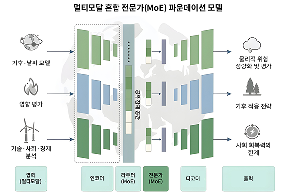
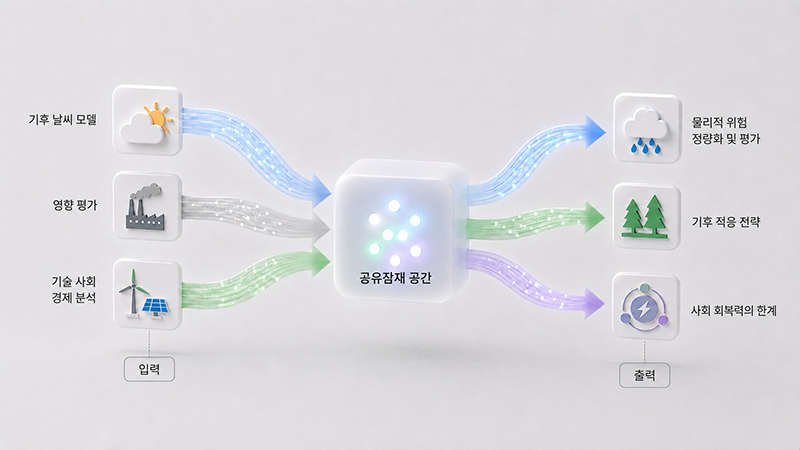

*기후 변화는 기온 상승뿐 아니라 경제·에너지·산업 전반에 영향을 미치는 복합 문제로, 미래를 정확히 예측하기 어렵다. KAIST·국제 연구진이 인공지능(AI)을 활용해 기후 변화와 사회·경제적 영향을 동시에 분석할 수 있는 차세대 기후 연구 모델을 제시했다.*

우리 대학은 녹색성장지속가능대학원 전해원 교수, 카르틱 무카빌리(Karthik Mukkavilli) 겸직교수, 전산학부 오혜연 교수 연구팀이 중국 북경대학교, 영국 임페리얼 칼리지 런던, 이탈리아 밀라노 폴리테크닉대학교, 미국 메릴랜드대학교, 오스트리아 국제응용시스템분석연구소(IIASA) 등 세계 유수 연구기관과의 국제 공동 연구를 통해 AI 기반 기후 연구 통합 프레임워크를 제시했다고 13일 밝혔다.

현재 기후 변화 연구는 물리적 기후 예측, 사회·경제 영향 분석, 에너지 정책 평가 등이 분야별로 분리돼 수행되는 경우가 많다. 서로 다른 데이터와 분석 체계를 사용하기 때문에 이를 종합적으로 연결해 정책 결정에 활용하는 데 시간이 오래 걸린다는 한계가 있었다.

연구팀은 이를 해결하기 위해 ‘AI 기반 기후 연구 파운데이션 모델(AI-Based Climate Research Foundation Model)’을 제안했다. 이 모델은 지구 관측 데이터, 에너지·경제 시나리오, 정책 지표 등 성격이 서로 다른 대규모 데이터를 AI가 공통된 방식으로 이해·분석할 수 있는 가상 분석 공간(shared latent space)에서 함께 처리한다.

이를 통해 기후 변화의 물리적 현상뿐 아니라 경제·사회적 영향까지 동시에 고려한 빠르고 정교한 예측이 가능해진다.

{fig-align="center"}

특히 연구팀은 ‘혼합 전문가(MoE, Mixture of Experts)’ 구조를 적용해 서로 다른 역할을 하는 AI 모델이 분야별 전문가처럼 협력하도록 설계했다. 물리 법칙 기반 계산 모듈과 통계 학습 기반 AI 모듈을 결합해 예측의 정확성과 신뢰성을 높였으며, 온실가스 감축 목표 도입이나 신재생에너지 확대 정책이 산업·경제에 미치는 영향을 빠르게 분석할 수 있도록 했다.

이번 연구는 단순히 기후를 예측하는 수준을 넘어, 정책 변화에 따른 사회·경제적 영향을 함께 분석할 수 있는 새로운 AI 기반 기후 연구 방향을 제시했다는 점에서 의미가 크다. 국제 학술지 네이처 클라이밋 체인지(Nature Climate Change)에 4월 28일 게재되었으며, AI기반 기후-인간 상호영향 차세대 통합평가모델 개발(과학기술정보통신부, 한국연구재단)과제의 지원으로 수행됐다.\
※ 기고문 : Artificial Intelligence to Support Cross-Disciplinary Climate Change Research, <https://doi.org/10.1038/s41558-026-02624-x>

한편 KAIST 연구팀은 이러한 프레임워크를 실제로 구현한 AI 기반 예측 모델도 함께 공개했다.

연구팀은 ‘에너지-온실가스 예측 고속 에뮬레이터(emulator)’를 시범 구현 모델(prototype) 형태로 개발했다. 이 모델은 기존의 복잡한 에너지·탄소배출 통합평가모델(IAM, Integrated Assessment Model) 계산 과정을 AI가 빠르게 대신 수행하도록 만든 기술이다.

기존 통합평가모델은 하나의 정책 시나리오를 분석하는 데 많은 시간과 계산 자원이 필요했지만, 연구팀이 개발한 AI 모델은 수천 개의 정책 시나리오를 단시간에 분석할 수 있다. 이를 통해 탄소중립 정책이나 에너지 전환 정책의 효과를 보다 빠르게 예측하고 정책 결정에 활용할 수 있을 것으로 기대된다.

쉽게 말해, 미래 기후와 경제 변화를 예측하는 ‘가상 정책 실험실’을 AI로 구현한 셈이다. 예를 들어 탄소세를 높이거나 재생에너지를 확대했을 때 온실가스 배출량과 경제 변화가 어떻게 달라지는지를 훨씬 빠르게 시뮬레이션할 수 있다.

{fig-align="center"}

신예은(Yen Shin) 석사과정 학생이 제1저자로 참여하고 오혜연 교수와 전해원 교수가 공동 교신저자로 참여한 해당 연구는 지구과학 모형 개발 전문 학술지 지오사이언티픽 모델 디벨롭먼트(Geoscientific Model Development)'에 1월 9일 심사전 공개 논문(preprint)으로 발표됐다.\
※ 논문명: ML-IAM v1.0: Emulating Integrated Assessment Models With Machine Learning, <https://doi.org/10.5194/egusphere-2025-5305>

해당 연구 성과는 세계 최대 AI 학회인 뉴립스(NeurIPS) 2025 ‘기후변화 대응 머신러닝’ 워크숍에 초청되어 발표됐으며, 기후학계와 AI산업계의 큰 관심을 받고 있다. 이 연구는 환경부의 재원으로 한국환경산업기술원의 관측 기반 공간정보지도 구축 기술개발사업 (RS-2023-00232066)의 지원으로 수행됐다.

전해원 교수와 오혜연 교수는 ‘KAIST AI4Good\*’ 연구 네트워크 창립 멤버로 활동하며 AI를 기후 위기 등 사회문제 해결에 활용하는 연구를 이어가고 있다.\
\*KAIST AI4Good: AI를 활용해 공공의 이익을 추구하는 연구 플랫폼(<https://ai4good.kaist.ac.kr/>)

전해원 교수는 “이번 기후-AI 모델은 기후 과학자와 정책 입안자 사이의 간극을 줄여줄 효과적인 가교 역할을 할 것으로 기대한다”며 “함께 공개한 고속 AI 에뮬레이터는 실시간에 가까운 정책 분석을 가능하게 해 실질적인 기후 대응 솔루션을 제공하는 핵심 기술이 될 것”이라고 말했다.

오혜연 교수는 “AI 기술은 단순한 상업적 도구를 넘어 인류 생존을 위협하는 기후 위기 해결에 기여해야 한다”며 “이번 국제 공동 연구는 AI가 사회적 난제 해결을 위한 글로벌 공공재 역할을 할 수 있음을 보여주는 사례가 될 것”이라고 강조했다.

주요 보도 기사 보기\
1. KBS: [**https://lnkd.in/gdy7-\_2D**](https://www.linkedin.com/safety/go/?url=https%3A%2F%2Flnkd%2Ein%2Fgdy7-_2D&urlhash=X9K3&mt=qOmZNQ3FBrb82uApzUwmZxxiIRTChJydA8eBsNDaYMtOtIh9FqhzHA5rBOMgNZPpLXoJzbyf-D61xs8lmMhw-NpdYxteyZCUAZpelG9l5ZoTVmPYfDc2OPlItg&isSdui=true)\
2. TJB: [**https://lnkd.in/gV5bM_ia**](https://www.linkedin.com/safety/go/?url=https%3A%2F%2Flnkd%2Ein%2FgV5bM_ia&urlhash=yvYP&mt=KB1xqMNeBFuomgLIGFJqAmirNaOUCsuUshZHB2430SkEn8dYJMKgEkbmH1a8UgFhSsq3zqEWn9A5shLXghcCVfIPCkmqKKvu7hLHIsrlQfBFsmLWSpjGDXaJuw&isSdui=true)\
3. YTN Science: [**https://lnkd.in/gRrWxsP8**](https://www.linkedin.com/safety/go/?url=https%3A%2F%2Flnkd%2Ein%2FgRrWxsP8&urlhash=cUcr&mt=x06wPMe9BvlJ4sKxD5iLn8UV09nWi7hYaPk5S6tQaI7sThs_oz_42WQ9JdPbputpXiMrbdE0RnsS3PUDn_W67mnAMf7CBAvsaFzni2CatP8og1D3NWtXuOXNFA&isSdui=true)\
4. Donga Science: [**https://lnkd.in/gu4Fw47N**](https://www.linkedin.com/safety/go/?url=https%3A%2F%2Flnkd%2Ein%2Fgu4Fw47N&urlhash=99mU&mt=kDBmUXMe1kLv25DyWefqpntAa9i6gSi2eoO-CLgCyWOCxIAsvvF7D-NZlQGOufNeGPGTUNpVwuI1VpJtbO51NRE5niQruAsuzGY2S8ngBhUkIvSYpCoAPtZE1Q&isSdui=true)\
5. Electronic Times: [**https://lnkd.in/ggNCKunG**](https://www.linkedin.com/safety/go/?url=https%3A%2F%2Flnkd%2Ein%2FggNCKunG&urlhash=yx51&mt=YBeUdODDJTMgTcvLf3ewYduN-fNiL3AKBPcWjanITApivvfNNyO2EqVr0-zeHYTxoNVRWXLoNBxkL-BPEKQdYNgRmu43trj-45pBRFq9dVo6oE-1z0p62yvm_g&isSdui=true)\
\
