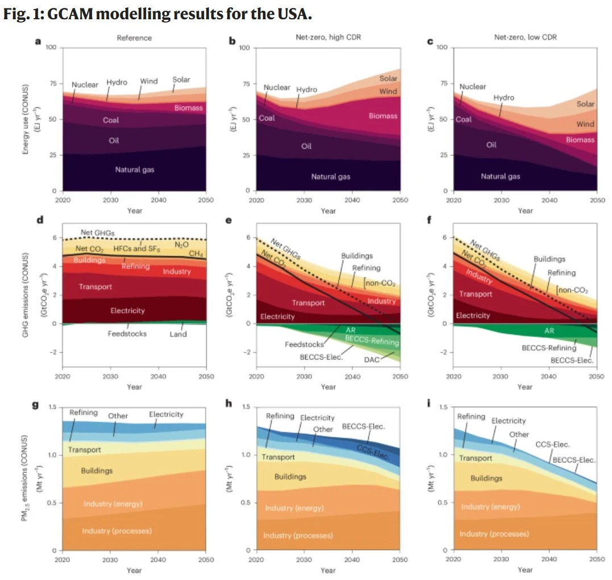

*A new study finds that while carbon dioxide removal can help the United States reach net-zero emissions, relying too heavily on CDR may generate more air pollutants. This could reduce the public health benefits of climate action and perpetuate air-pollution inequalities, especially for low-income and minority communities.*

As net-zero planning increasingly turns to carbon dioxide removal, a new study published in Nature Climate Change asks an important question: what happens to air pollutants when carbon removal is used to offset emissions instead of eliminating them at the source?

Using a suite of integrated assessment model, air-quality model, and health impact model, the study shows that the scale of CDR can shape not only how much air pollution is emitted, but also how equitably those emissions are shared across U.S. communities.

{fig-align="center"}

The paper compares a reference scenario with two U.S. net-zero pathways that both reach net-zero greenhouse gas emissions by 2050, but differ in how much they rely on CDR. In the high-CDR pathway, 2.4 GtCO₂ is removed in 2050, while the low-CDR pathway removes 1.3 GtCO₂.

Both net-zero scenarios reduce PM2.5 pollution and related premature deaths compared to the reference case. However, the low-CDR pathway brings larger health co-benefits because it requires deeper cuts in fossil fuel use and leaves fewer associated air pollutants in place. By 2050, PM2.5-related deaths fall from about 203,000 in the reference scenario to 159,000 in the high-CDR scenario and 127,000 in the low-CDR scenario. This means the low-CDR pathway avoids about 33,000 additional deaths compared with the high-CDR pathway.

The study also finds that these additional co-benefits are not evenly distributed. Low-income and minority communities tend to face higher air pollution and mortality risks in both net-zero scenarios, but these inequalities are generally smaller when CDR deployment is limited. The findings suggest that climate mitigation and environmental justice need to be planned together, rather than treated as separate policy goals.

"While CO2 removal is becoming an inevitable tool for reaching net-zero emissions, our research shows that over-reliance on CDR poses additional risk to public health,” said Prof. Haewon McJeon of KAIST Graduate School of Green Growth and Sustainability. “Greater air pollution associated with delayed decarbonization could lead to higher mortality rates, particularly in low-income communities. These findings underscore the need for a holistic strategy that integrates CO2 reduction with robust air pollution controls."

The study highlights that CDR is not only a climate change mitigation tool, but also a indirect influencer of public health and environmental justice. Reaching net-zero with less reliance on CDR can deliver greater air-quality benefits, especially for communities that already bear a disproportionate pollution burden. The authors emphasize that a more equitable transition will require faster emissions reductions, limited use of CDR, and deliberate planning to reduce air pollution inequalities.

Paper link: <https://www.nature.com/articles/s41558-026-02675-0>
