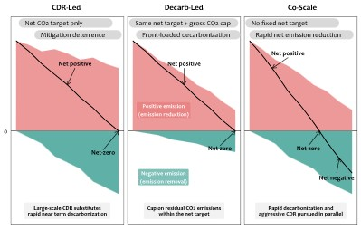

*A new study published in Environmental Science & Technology explores the potential benefits and constraints of pursuing large-scale carbon dioxide removal (CDR) and rapid decarbonization in parallel.*

Carbon dioxide removal (CDR) is an important tool for achieving climate goals. However, concerns that future large-scale carbon removal could weaken present-day emissions reductions have led to growing interest in decarbonization-focused pathways that limit reliance on CDR. Yet such approaches may also make it more difficult to deploy large-scale carbon removal when it is needed in the future. To address this challenge, the study proposes a new climate mitigation pathway (Co-Scale), which scales up carbon dioxide removal and emissions reductions simultaneously.

{fig-align="center" width="600"}

The study uses GCAM-TJU 8.0, a modified version of the GCAM model that allows CDR and emission reductions to be pursued under separate policy targets. The model was then used to compare three mitigation pathways: a CDR-led pathway, a decarbonization-led pathway, and the Co-Scale pathway, which simultaneously scales up both emission reductions and carbon dioxide removal.

As a result, the Co-Scale pathway achieved the strongest climate outcomes among the three scenarios. It delivered the deepest cumulative net CO₂ emissions over the century at -877 GtCO₂, the lowest peak warming at 1.56°C, and end-of-century warming of only 1°C above pre-industrial levels. Notably, the pathway reached net-zero CO₂ emissions by 2043 and remained above the 1.5°C threshold for only 30 years, substantially shorter than the 57 and 54 years observed in the CDR-led and decarbonization-led pathways, respectively.

Meanwhile, geological CO₂ storage emerged as the most important bottleneck for the Co-Scale pathway. The study found that Co-Scale would require geological storage capacity exceeding the median prudent storage limit by 208 GtCO₂ by 2100. This increased storage demand is driven by both fossil CCS and CCS-based carbon removal technologies, including BECCS and DACCS.

"For years, the climate community has been divided between aggressively reducing GHG emissions or scaling massive carbon removal," said Prof. Haewon McJeon of KAIST Graduate School of Green Growth and Sustainability. "It doesn’t need to be that way. We can have both. If we succeed, we’ll be able to minimize the duration of a risky temperature overshoot roughly in half."

This study provides important insights for developing more effective and integrated climate mitigation strategies to achieve the Paris Agreement’s 1.5°C target.

Read the paper here: <https://doi.org/10.1021/acs.est.5c17017>

**한국어 요약**

**탄소 제거와 탈탄소화 동시 확대 전략의 기후 효과 및 제약 요인 분석**

탄소 제거(Carbon Dioxide Removal, CDR)는 기후 목표 달성을 위한 중요한 수단으로 여겨진다. 그러나 최근에는 미래의 대규모 탄소 제거에 대한 기대가 오히려 현재의 배출 감축 노력을 약화시킬 수 있다는 우려가 제기되면서, CDR 의존도를 낮추고 빠른 탈탄소화를 우선시하는 경로들이 제안되고 있다. 반면 이러한 접근 역시 미래에 대규모 탄소 제거가 필요해질 경우 대응이 어려워진다는 한계를 가진다. 이에 본 연구는 탄소 제거와 배출 감축 중 하나에 의존하는 기존 경로를 넘어, 두 전략을 동시에 확대하는 새로운 기후 완화 경로(Co-Scale)를 제시하였다.

이를 위해 해당 연구에서는 CDR이 배출 감축을 일부 대체할 수 있는 기존 GCAM 모델을 수정하여, 두 전략에 독립적인 목표치를 부여할 수 있는 GCAM-TJU 8.0을 개발하였다. 연구진은 이를 활용하여 CDR 중심 경로와 탈탄소화 중심 경로, 그리고 두 전략을 동시에 확대하는 Co-Scale 경로를 비교·분석하였다. 이를 통해 탄소 제거와 배출 감축을 병행하는 전략이 기존의 기후 완화 경로보다 어떤 추가적인 이점을 제공할 수 있는지 평가하였다.

그 결과, Co-Scale은 세기에 걸쳐 -877 GtCO2의 누적 순배출량을 달성하였으며, 1.56°C의 가장 낮은 최고기온(peak warming)과 산업화 이전 대비 1°C의 세기말 온난화를 보이는 등 가장 우수한 기후 성과를 나타냈다. 특히 이 시나리오는 2043년에 순 배출 제로에 도달하였으며, 1.5°C를 초과하는 기간 역시 30년으로 나타났는데, 이는 CDR 중심 경로와 탈탄소화 중심 경로에서 각각 나타난 57년과 54년에 비해 크게 단축된 수치이다.

한편 이 과정에서 지질학적 이산화탄소 저장 용량은 Co-Scale 경로의 가장 중요한 제약 요인으로 나타났다. 연구에 따르면 Co-Scale 경로는 2100년까지 현재 추정되는 현실적 저장 용량 한계를 약 208 GtCO₂ 초과하는 수준의 저장 공간을 필요로 하는 것으로 분석되었다. 이러한 저장 수요 증가는 화석연료 CCS뿐 아니라 BECCS와 DACCS 등 CCS 기반 탄소 제거 기술의 대규모 확대에 기인한다.

KAIST 녹색성장지속가능대학원 믹전해원 교수는 “오랫동안 기후 분야에서는 온실가스 배출을 적극적으로 감축하는 것과 대규모 탄소 제거를 확대하는 것 사이에서 의견이 갈려 있었다” 라고 말했다. 그는 이어, “하지만 반드시 둘 중 하나를 선택해야 하는 것은 아니다. 우리는 두 전략을 동시에 추진할 수 있다. 만약 이를 성공적으로 실현한다면, 위험한 온도 초과 상태가 지속되는 기간을 거의 절반으로 줄일 수 있을 것이다.”라고 덧붙였다.

이러한 결과는 파리협정의 1.5°C 목표 달성을 위한 보다 효과적이고 통합적인 기후 완화 전략 수립에 중요한 시사점을 제공한다.

논문 바로가기: <https://doi.org/10.1021/acs.est.5c17017>
