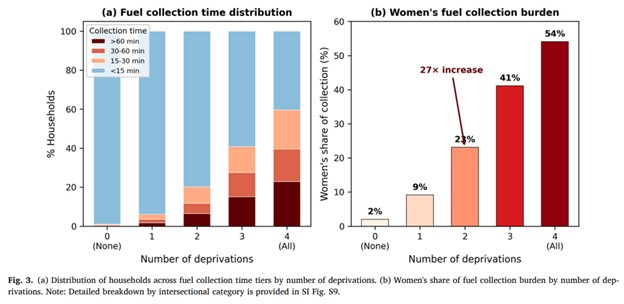

*A new study published in Energy and Climate Change brings together two perspectives - different dimensions of energy poverty and intersectionality - within a single analytical framework.*

Using nationally representative household data from India, the research examines how caste, rural location, education, and income poverty intersect to shape critical access to electricity and cooking fuels, affordability, and access to energy services

How to identify energy poverty and understand the factors that shape it? A new analysis published in Energy and Climate Change tackles this critical question, providing new insights into how intersecting social and economic factors influence energy poverty, how these factors affect energy affordability, and why intersectional vulnerabilities can vary across different dimensions of energy poverty.

The study examines energy poverty in India through an intersectional perspective, focusing on how different social and demographic factors can combine to create different levels of vulnerability. Using an intersectional analytical approach, the authors investigate how factors such as income, gender, age, geography, household characteristics, and access to energy interact and shape people's ability to access affordable and reliable energy.

The study shows that energy poverty cannot be fully explained by income alone, as overlapping vulnerabilities can make some groups significantly more exposed to energy insecurity. These findings highlight the need for energy policies that consider multiple dimensions of vulnerability rather than treating low-income households as a single group.

“Energy poverty isn’t just about income level. It depends on the multiple interlinked deprivations,” said Prof. Haewon McJeon of KAIST Graduate School of Green Growth and Sustainability. “Climate and energy policies must take this into account to be effective.”

This research provides valuable insights for policymakers and energy planners, emphasizing the importance of addressing the intersectional vulnerabilities that shape energy poverty and developing more inclusive energy policies in India.

\[paper link\]: <https://doi.org/10.1016/j.erss.2026.104930>
