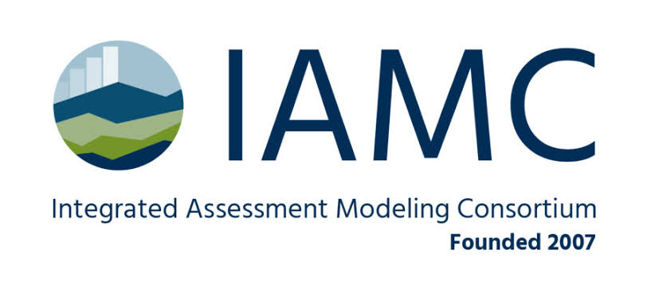
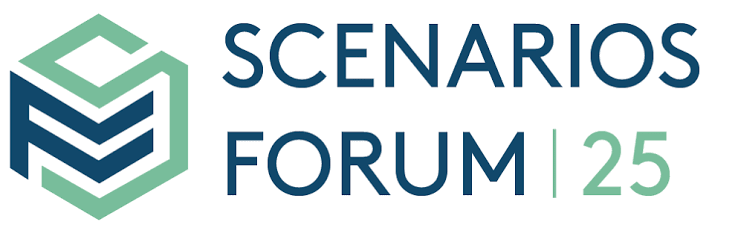
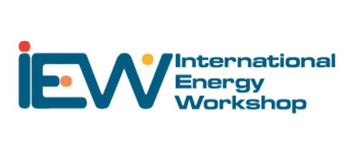
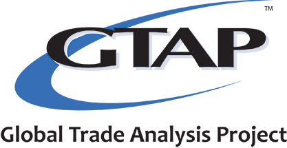

  

    
KAIST IAM Group

    <h1>Resources</h1>
  

Journals and conferences central to our work in integrated assessment modeling, energy systems, and climate policy.

## Journals

Our group publishes in leading journals on climate, energy, and integrated assessment.

- [Nature](https://www.nature.com/) — including [Nature Climate Change](https://www.nature.com/nclimate/), [Nature Energy](https://www.nature.com/nenergy/), and [Nature Communications](https://www.nature.com/ncomms/)
- [Science](https://www.science.org/)
- [Energy Economics](https://www.elsevier.com/journals/energy-economics/0140-9883)
- [Climatic Change](https://link.springer.com/journal/10584)
- [Environmental Research Letters](https://iopscience.iop.org/journal/1748-9326)
- [Energy and Climate Change](https://www.elsevier.com/journals/energy-and-climate-change/2666-2787)

## Conferences

Our group regularly presents at international conferences on integrated assessment modeling, energy systems, and global economic analysis.

<a href="https://www.iamconsortium.org/" target="_blank" class="info-card" style="display:block; text-align:center; text-decoration:none; color:inherit;"><h3 style="margin:0 0 6px; font-size:1rem;">IAMC</h3>
Integrated Assessment Modeling Consortium
</a><a href="https://scenariosforum.org/" target="_blank" class="info-card" style="display:block; text-align:center; text-decoration:none; color:inherit;"><h3 style="margin:0 0 6px; font-size:1rem;">Scenarios Forum</h3>
Forum on Scenarios for Climate and Societal Futures
</a><a href="https://www.internationalenergyworkshop.org/" target="_blank" class="info-card" style="display:block; text-align:center; text-decoration:none; color:inherit;"><h3 style="margin:0 0 6px; font-size:1rem;">IEW</h3>
International Energy Workshop
</a><a href="https://www.gtap.agecon.purdue.edu/" target="_blank" class="info-card" style="display:block; text-align:center; text-decoration:none; color:inherit;"><h3 style="margin:0 0 6px; font-size:1rem;">GTAP</h3>
Annual Conference on Global Economic Analysis
</a>
